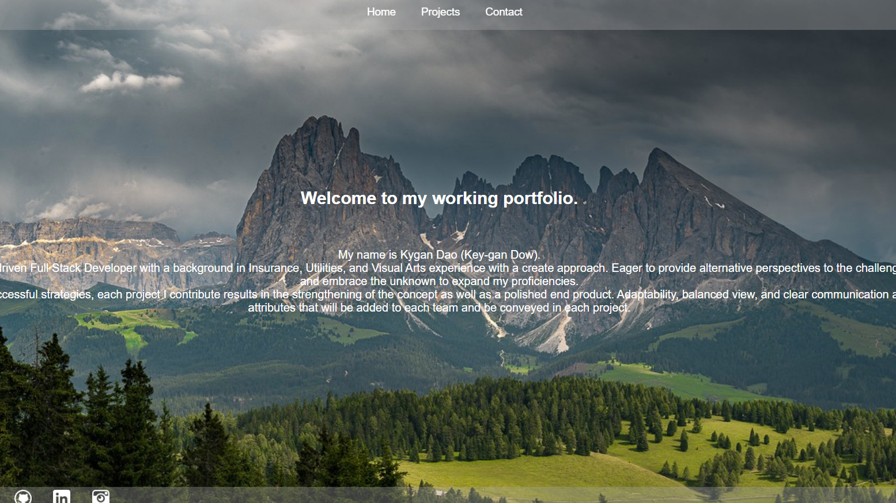

# react-portfolio
  
## Table of Contents:
  1. [Username](#username)
  2. [Email](#email)
  3. [Description](#description)
  4. [Installation](#installation)
  5. [Usage](#usage)
  6. [License](#license)
  7. [Contribution Guidelines](#contributing-guidelines)
  8.[Screenshot])#screenshot

## Username
kygandao

## Email
kygandao23@gmail.com

## Description
This front-end deployed project is another version of my portfolio created using purely React and CSS.

## Installation
No installations required

## Usage
The user will access the application here: https://kygandao.github.io/react-portfolio/ or https://kd-react-portfolio.herokuapp.com/

## License

## Contribution Guidelines
Contact me before contributions

## Screenshot

